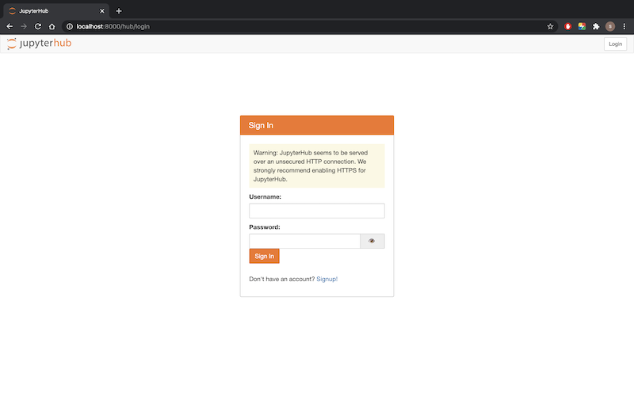
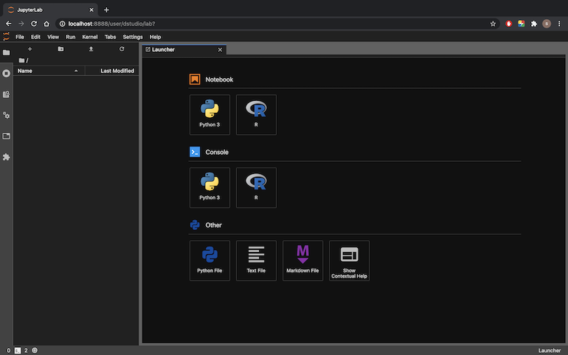
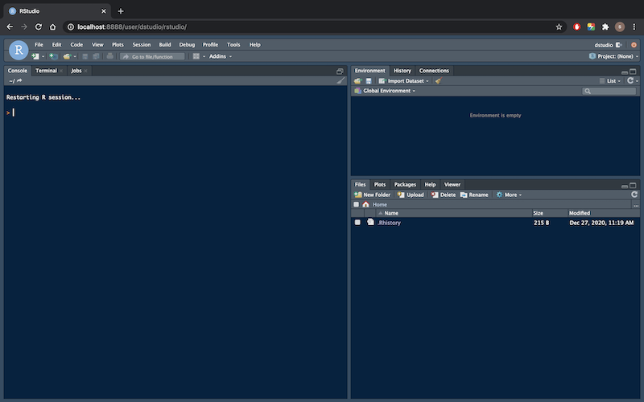

# dstudio

<!-- badges: start -->
<!-- badges: end -->

dstudio 是一个将 rstudio server 和 jupyterlab 打包在一起的 docker 容器。极大的简化了在线建模分析平台的搭建。部署在服务器上之后，支持多用户通过浏览器远程登陆 R 与 python 环境，一方面可以充分利用服务器的计算资源，另一方面便于团队内成员建模分析环境的配置与管理。需要说明的是 [rstudio server Pro](https://rstudio.com/products/rstudio-server-pro/) 提供了更为全面的功能与服务。本项目主要是提供了一个开箱即用的免费开源选项。



## 如何开始

首先需要配置 docker 环境，其安装过程参见[docker 在线文档](https://docs.docker.com/get-started/)。

安装好 docker 之后，在终端中运行以下代码，就可以通过浏览器访问 rstudio server 和 jupyterlab 了。如果部署在本地电脑上，访问地址为 `http://localhost:8000/`；如果部署在服务器上，将 localhost 替换为对应服务器的ip地址。
```
# 下载 docker-compose.yml 文件
curl -OL https://raw.githubusercontent.com/ShichenXie/dstudio/master/docker-compose.yml --output docker-compose.yml

# 下载 dstudio_hub 和 dstudio_lab image
docker pull shichenxie/dstudio_hub:1.3.0
docker pull shichenxie/dstudio_lab:ds1.3.0

# 启动服务
docker-compose up -d
# 停止服务
# docker-compose down
```

## 用户登陆与新建

默认的管理员用户为 dstudio，该账号可以通过 docker-compose.yml 中的 HUB_ADMIN_USER 参数进行修改。管理员的密码和普通用户的一样，都需要通过点击 Signup 进入注册页面在创建用户时生成。然后点击 Login，回到登陆页输入用户名和设定的密码。登陆之后默认进入 jupyterLab 页面，可在下拉菜单 File 中退出登陆 (Log Out)，或进入管理页面 (Hub Control Panel)。该页面对应 url 为 `http://localhost:8000/user/dstudio/lab`，可以将其中最后的 lab 修改为 rstudio 进入 rstudio server 页面。




### 新建用户

先在登陆页面 `http://localhost:8000/` 点击 Signup，进入注册页面新建用户并设定密码，假设新用户名为 test。然后由管理员登陆，并跳转至 `http://localhost:8000/hub/authorize` 页面进行审批，即完成了新用户的创建。

### 修改密码

用原密码登陆之后，进入 `http://localhost:8000/hub/change-password` 页面可以更新密码。

## 贡献与参考

如果您对本项目感兴趣，欢迎star。如果有任何想法可以提交 issue 或者 pr。

本项目适合中小型团队搭建在线建模分析平台，参考了 [defeo/jupyterhub-docker](https://github.com/defeo/jupyterhub-docker) 与 [jupyterhub/jupyterhub-deploy-docker](https://github.com/jupyterhub/jupyterhub-deploy-docker)；对于大型团队需要集群扩展的可以参考 [zero-to-jupyterhub-k8s](https://zero-to-jupyterhub.readthedocs.io/en/stable/) 项目。
类似的项目还有 [ShinyStudio](https://github.com/dm3ll3n/ShinyStudio)，不过是基于  [shinyproxy](https://www.shinyproxy.io/) 开发的。

本项目参考了以下内容或项目：
- [Docker — 从入门到实践](https://yeasy.gitbook.io/docker_practice/)
- [A Docker tutorial for reproducible research.](http://ropenscilabs.github.io/r-docker-tutorial/)
- [Jupyter](https://jupyter.org/), [JupyterHub](https://jupyterhub.readthedocs.io/), [DockerSpawner](https://jupyterhub-dockerspawner.readthedocs.io/)
- [JupyterHub Native Authenticator](https://native-authenticator.readthedocs.io/en/latest/)
- [jupyter-rsession-proxy](https://github.com/jupyterhub/jupyter-rsession-proxy)
- [RStudio Server Pro - Administration Guide](https://docs.rstudio.com/ide/server-pro/latest/)
- [Version-stable Rocker images](https://github.com/rocker-org/rocker-versioned)
- [traefik-book](https://www.qikqiak.com/traefik-book/), [traefik-proxy](https://jupyterhub-traefik-proxy.readthedocs.io/en/latest/install.html)

