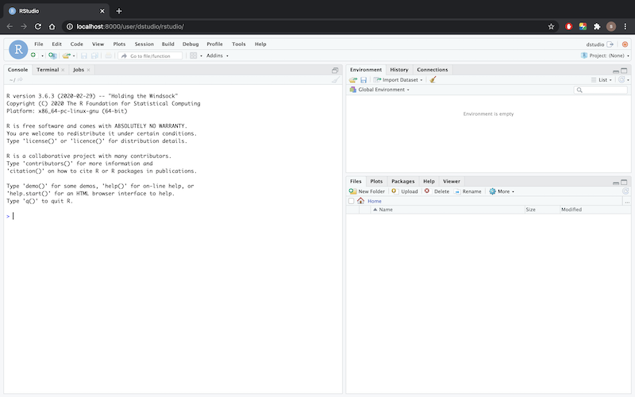

# dstudio

<!-- badges: start -->
<!-- badges: end -->

dstudio 是一个将 rstudio server 和 jupyter notebook 打包在一起的 docker 容器。极大的简化了在线建模分析平台的搭建。部署在服务器上之后，支持多用户通过浏览器远程登陆 R 与 python 环境，一方面可以充分利用服务器的计算资源，另一方面便于团队内成员建模分析环境的配置与管理。需要说明的是 [rstudio server 专业版](https://rstudio.com/products/rstudio-server-pro/)提供了更为全面的功能与服务。本项目主要是提供了一个开箱即用的免费开源选项。

# 如何开始

首先需要配置 docker 环境，其安装过程参见[docker 在线文档](https://docs.docker.com/get-started/)。

安装好 docker 之后，需要在电脑上新建文件夹作为 docker 容器指向的用户目录。即在该文件夹存储 dstudio 的用户文件，否则 docker 容器删除之后，用户的建模分析结果就会丢失了。
```
mkdir -p $HOME/docker/dstudio
```

然后在终端中运行以下代码，就可以通过浏览器访问 rstudio server 和 jupyter notebook 了。如果部署在本地电脑上，访问地址为 `http://localhost:8000/`；如果部署在服务器上，将 localhost 替换为对应服务器的ip地址。
```
docker run -d -p 8000:8000 -v $HOME/docker/dstudio:/home --restart=always --name dstudio shichenxie/dstudio:0.1.0
```

登陆过程。默认的用户名为 dstudio，该账号有管理员权限。密码需要通过点击 Signup 进入注册页面创建用户时生成。然后点击 Login，回到登陆页输入 dstudio 和设定的密码。登陆之后进入 jupyter 页面，在右边的 New 下拉框中选择 RStudio，进入 rstudio server 环境。




创建新用户过程。先由新用户在 `http://localhost:8000/` 页面点击 Signup，进入注册页面新建用户并设定密码，假设新用户名为 test。然后由管理员 dstudio 登陆，并跳转至 `http://localhost:8000/hub/authorize` 页面进行审批。由于这里的用户权限管理系统使用的是 [JupyterHub 的 nativeauthenticator](https://native-authenticator.readthedocs.io/en/latest/)，不支持自动创建系统用户（其他的用户权限管理方式支持在 Control Panel 中创建系统用户，但是需要依托外部系统，例如LDAP等）。因此还需要回到终端中输入 ```docker exec -it dstudio bash```，进入运行中的容器创建系统用户 `useradd --create-home test`。

经过以上步骤，新用户 test 就可以登陆使用了，不过暂时还无法启动 rstudio server。因为多用户访问 rstudio server 时，需要为每一位用户生成相应的  secret-cookie-key。当第一位用户打开 rstudio server 之后，会自动在 /tmp/rstudio-server/ 中生成该文件，并且只有第一位用户拥有读写权限。这里可以进入容器中 ```docker exec -it dstudio bash```，直接修改该文件的权限 ```chmod -R 777 /tmp/rstudio-server/secure-cookie-key```，前提是该文件已经存在，也就是已经有一个用户打开过了 rstudio server。本步骤只需要操作一次，其他新用户创建过程参照上一步即可。

修改密码。用原密码登陆之后，进入 `http://localhost:8000/hub/change-password` 页面可以更新密码。

# 贡献与参考

如果您对本项目感欢迎使用、star。由于目前还有一些功能可以完善，例如：自动创建用户目录、降低容器的大小（现在有7G多）等，如果您有任何想法欢迎讨论，或者直接提交pr。

类似的项目有 [ShinyStudio](https://github.com/dm3ll3n/ShinyStudio)，不过是基于  [shinyproxy](https://www.shinyproxy.io/) 开发的。

本项目参考了以下内容或项目：
- [A Docker tutorial for reproducible research.](http://ropenscilabs.github.io/r-docker-tutorial/)
- [JupyterHub](https://jupyter.org/hub)
- [JupyterHub Native Authenticator](https://native-authenticator.readthedocs.io/en/latest/)
- [jupyter-rsession-proxy](https://github.com/jupyterhub/jupyter-rsession-proxy)
- [RStudio Server Professional Edition - Administration Guide](https://docs.rstudio.com/ide/server-pro/latest/)

