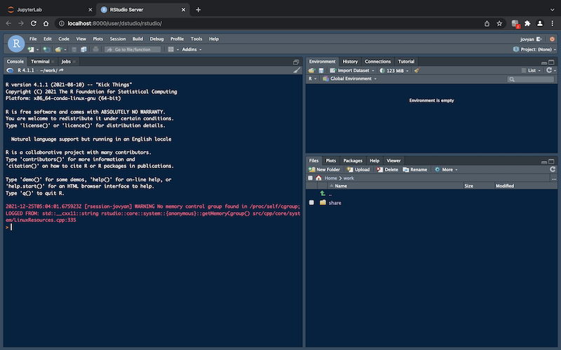

# dstudio

<!-- badges: start -->
<!-- badges: end -->

dstudio 是一个在 [jupyterhub](https://hub.docker.com/r/jupyterhub/jupyterhub/tags) 和 [jupyterlab 科学计算](https://hub.docker.com/r/jupyter/datascience-notebook/)容器基础上配置了 [rstudio server](https://posit.co/download/rstudio-server/) 与 [shiny server](https://posit.co/download/shiny-server/) 环境的应用。 dstudio 极大的简化了在线建模分析展示平台的搭建。部署在服务器上之后，支持多用户通过浏览器远程登陆 R 、Python 与 Julia 计算环境，并部署 shiny 服务，一方面可以充分利用服务器的计算资源，另一方面便于团队内成员建模分析环境的配置与管理。本项目提供了一个开箱即用的免费开源方案，适用于中小型团队，也可以用于个人电脑上。

dstudio 包含 dstudio_hub 和 dstudio_lab 两个容器（image），
- 其中，dstudio_hub 负责用户管理，并调用 dstudio_lab 容器为每位用户自动生成独立的计算环境（container）；
- dstudio_lab 为建模分析所需的 IDE（jupyterlab、rstudio）以及各类工具包，包含三个版本（dstudio_lab:4.0、dstudio_lab:4.0r、dstudio_lab:4.0base），用户可以根据自己的需要进行选择。


## 如何开始

首先需要配置 docker 环境，其安装过程参见 [docker 在线文档](https://docs.docker.com/get-started/)。

### 下载 docker image

配置好 docker 环境之后，如果服务器能够直接连接互联网，在终端中运行以下代码即可直接从 [dockerhub](https://hub.docker.com/repositories) 下载使用到的两个 docker image；如果没有互联网连接，可以先下载之后保存为离线文件，再拷贝至服务器加载。

```
# 直接下载 dstudio_hub 和 dstudio_lab image
docker pull shichenxie/dstudio_hub:4.0
docker pull shichenxie/dstudio_lab:4.0
docker pull shichenxie/dstudio_lab:4.0base 

# 保存为离线文件
# docker save shichenxie/dstudio_hub:4.0 -o ~/Downloads/dstudio_hub.tar
# docker save shichenxie/dstudio_lab:4.0 -o ~/Downloads/dstudio_lab.tar
# 加载本地的 image
# docker load --input dstudio_hub.tar
# docker load --input dstudio_lab.tar
```

### 启动服务

该服务通过 docker compose 启动。首先在服务器中下载 docker-compose.yml 文件，该文件在本项目的根目录中已经提供了，可以通过命令行下载 (`curl -OL https://raw.githubusercontent.com/ShichenXie/dstudio/master/docker-compose.yml --output docker-compose.yml`)，或者直接手动复制保存。然后在 terminal 中进入保存了该文件的目录，并运行以下代码就启动服务了，最终实现浏览器访问。

```
# 启动服务
docker-compose up -d

# 停止服务
# docker-compose down
```
如果部署在个人电脑上，访问地址为 `http://localhost:8000/`；如果部署在服务器上，将 localhost 替换为对应服务器的ip地址，注意服务器需要开通 8000 端口的网络访问权限。
- 登陆页面：`http://localhost:8000/`
- 用户授权：`http://localhost:8000/hub/authorize`
- 更改密码：`http://localhost:8000/hub/change-password`

### 用户登陆与新建

所有用户（包括管理员）首次登陆时，都需要在登陆页面点击 Signup 进入注册页面进行创建。用户注册之后点击 Login，回到登陆页进行登录。管理员用户注册后可直接登录，普通用户需要管理员的审批授权才能登录。默认进入 jupyterLab 页面，用户登陆之后，可以选择合适的 dstudio_lab 版本。用户登出在下拉菜单 File 中退出登陆 (Log Out)，管理员还可以进入管理页面 (Hub Control Panel)。
- 默认的管理员用户为 dstudio，该账号可以通过 docker-compose.yml 中的 HUB_ADMIN 参数进行修改。




## 功能简介

### 用户文件

每个用户登陆之后默认进入 `～/work` 文件夹，该文件夹将默认固化至 `jupyterlab-user-xxx` volume（xxx 为用户名），从而持久化保存用户的个人文件。在服务器的 terminal 中可通过 `docker volume ls` 查看所有 volume。

在 `～/work` 文件夹中还有一个 share 文件夹指向 `～/share`，这个文件夹内的任何修改将固化至 `jupyterlab-share` volume。所有用户的 share 文件夹都固化至同一个 volume，从而实现多用户之间的文件共享。

如果在个人电脑上使用，可以将 `～/work` 文件夹指向个人电脑的文件夹，需要将 docker-compose.yml 文件中的 LAB_DIR_HOST 参数配置为对应文件夹路径。

### R 与 Python

主页为 jupyterlab 页面，其对应 url 为 `http://localhost:8000/user/dstudio/lab`，最后的 lab 修改为 rstudio 进入 rstudio server 页面，可以分别使用 Python 和 R 开展数据建模分析相关工作。而且 R 与 Python 之间是相互打通了的，在 R 环境中可使用 [reticulate 包](https://rstudio.github.io/reticulate/)访问 Python；而在 Python 环境中可使用 [rpy2 包](https://rpy2.github.io/)访问 R。如果团队内有使用 Julia 也可以直接通过 jupyterlab 开展相关工作。

### shiny 服务

将主页 url 最后的 lab 修改为 shiny，则能够进入 shiny 服务的页面。管理员主页上有shiny服务的按钮，不需要手动修改 url。该 shiny 服务部署在 `/srv/shiny-server` 文件夹，可以根据自己的需要将该文件夹更新，并固化到 docker 容器之后，所有用户就能够访问定制化的 shiny 服务了。

### cron 任务

该容器还支持 cron 定时任务，在 jupyterlab 或 rstudio server 页面的 terminal 窗口中，输入 cron service start 之后，即可通过 [cronR 包](https://github.com/bnosac/cronR)管理 cron 定时任务。


### 待完善功能

- 增加反向代理功能，例如：traefik。
- 增加集群支持，目前还只支持单服务器。

## 贡献与参考

如果您对本项目感兴趣，欢迎star。如果有任何想法可以提交 issue 或者 pr。

本项目适合中小型团队在单服务器上搭建在线建模分析平台，参考了 [defeo/jupyterhub-docker](https://github.com/defeo/jupyterhub-docker) 与 [jupyterhub/jupyterhub-deploy-docker](https://github.com/jupyterhub/jupyterhub-deploy-docker)；对于大型团队需要集群扩展的可以参考 [zero-to-jupyterhub-k8s](https://zero-to-jupyterhub.readthedocs.io/en/stable/) 项目。
类似的项目还有 [ShinyStudio](https://github.com/dm3ll3n/ShinyStudio)，不过是基于  [shinyproxy](https://www.shinyproxy.io/) 开发的。

本项目参考了以下内容或项目：
- [Docker — 从入门到实践](https://yeasy.gitbook.io/docker_practice/)
- [A Docker tutorial for reproducible research.](http://ropenscilabs.github.io/r-docker-tutorial/)
- [Jupyter](https://jupyter.org/), [JupyterHub](https://jupyterhub.readthedocs.io/)([jupyterhub-deploy-docker](https://github.com/jupyterhub/jupyterhub-deploy-docker)), [DockerSpawner](https://jupyterhub-dockerspawner.readthedocs.io/), [JupyterHub Native Authenticator](https://native-authenticator.readthedocs.io/en/latest/)
- [jupyter-rsession-proxy](https://github.com/jupyterhub/jupyter-rsession-proxy)
- [RStudio Server Pro - Administration Guide](https://docs.rstudio.com/ide/server-pro/latest/)
- [Version-stable Rocker images](https://github.com/rocker-org/rocker-versioned)
- [traefik-book](https://www.qikqiak.com/traefik-book/), [traefik-proxy](https://jupyterhub-traefik-proxy.readthedocs.io/en/latest/install.html)

